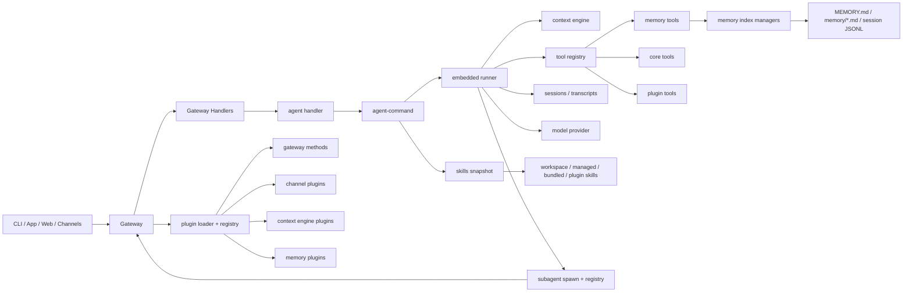
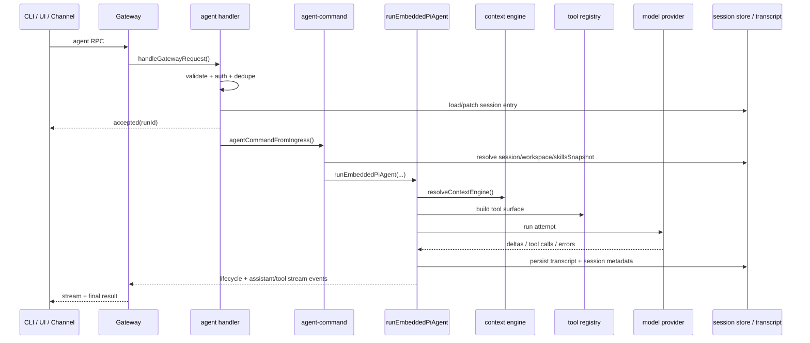
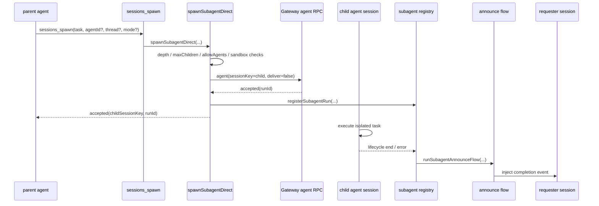

# OpenClaw 技术架构探索

本文是对当前 `openclaw` 仓库的技术架构梳理，目标是给后续科研 Agent 方案提供一份稳定的底座参考文档。

本文聚焦四个核心主题：

1. Gateway 控制平面
2. agent 调度与 subagent
3. memory / skills / plugins
4. 模块依赖与调用链

## 1. 总体判断

OpenClaw 的核心不是一个单纯的聊天机器人，而是一个本地优先的 AI 控制平台。

可以把整体结构压缩成一条主链：

`CLI / App / Web / Channels -> Gateway -> Agent Runtime -> Tools / Plugins / Memory / Sessions`

其中：

- `Gateway` 是统一控制平面
- `Agent Runtime` 是真实执行平面
- `Subagent` 是系统级并行执行能力
- `Memory` 是 `Markdown + SQLite 索引` 的内容记忆系统
- `Skills` 是 prompt 级方法论注入
- `Plugins` 是运行时代码扩展总线

## 2. 启动链路

从入口看，OpenClaw 是一个先装配控制面、再进入 agent 运行时的系统。

关键路径：

- `openclaw.mjs`
- `src/entry.ts`
- `src/cli/run-main.ts`
- `src/cli/program/build-program.ts`
- `src/cli/program/command-registry.ts`

总体上：

1. CLI 进入命令系统
2. 命令按需装配
3. 需要控制面的命令走 Gateway
4. 需要执行模型的命令进入 agent runtime

这说明 CLI 本质上是一个控制台外壳，而不是核心运行时本身。

## 3. Gateway 控制平面

OpenClaw 最关键的结构是 Gateway。

核心文件：

- `src/gateway/server.impl.ts`
- `src/gateway/server-methods.ts`
- `src/gateway/server-methods/agent.ts`
- `src/gateway/server-plugins.ts`
- `docs/gateway/protocol.md`

Gateway 的职责不是“接一个 WebSocket”这么简单，它负责：

- WebSocket RPC 入口
- 统一鉴权与 scope 校验
- session / run 管理
- plugin gateway method 扩展
- channel / node / config / cron / health 管理
- 给 CLI / UI / App / channel 提供统一控制面

工程上更准确的理解是：

**Gateway 是 OpenClaw 的 control plane。**

### 3.1 Gateway 启动装配

从 `src/gateway/server.impl.ts` 看，启动阶段会完成这些事情：

- 加载配置与 secrets
- 初始化 subagent registry
- 加载插件并合并 gateway handlers
- 初始化 channel manager、cron、heartbeat、health monitor、node registry
- 创建 runtime state
- 建立统一 `GatewayRequestContext`
- 挂载 HTTP / WS 请求处理

因此 Gateway 不是“薄网关”，而是整个平台的控制宿主。

### 3.2 Gateway 请求分发

主入口是统一分发逻辑：

- 校验 method 与权限
- 进入 core handlers 或 plugin handlers
- 在 plugin runtime request scope 中运行

这意味着插件不仅能扩工具，也能直接扩控制面能力。

### 3.3 `agent` 方法的真实职责

`src/gateway/server-methods/agent.ts` 不是“直接跑 agent”，而是做：

- 参数验证
- 会话一致性检查
- 去重
- session entry 持久化
- run 接收确认
- 再异步投递到 agent 执行入口

所以 `agent` 方法本质上是：

`控制面接入 -> 会话元数据落盘 -> 异步分发执行`

## 4. Agent 执行与调度

核心文件：

- `src/agents/agent-command.ts`
- `src/agents/pi-embedded-runner/run.ts`
- `docs/concepts/agent-loop.md`

这部分是 OpenClaw 的 execution plane。

### 4.1 主执行链

可以压缩成：

`Gateway agent RPC -> agent-command -> runEmbeddedPiAgent -> runEmbeddedAttempt`

职责拆分很清楚：

- `agent-command.ts`
  - 运行前装配
  - session / workspace / agentDir 解析
  - skills snapshot 生成
  - session metadata 写回
  - provider / model override 解析
- `run.ts`
  - 运行时 while-loop
  - context engine 装配
  - model 调用
  - tool 调用
  - retry / failover / compaction
  - transcript 持久化

这说明 OpenClaw 明确区分：

- 运行前编排
- 运行时执行

### 4.2 调度模型

从相关代码可看出，它不是复杂分布式 scheduler，而是：

- 基于 lane 的串并发控制
- session 内优先串行
- 全局按 lane 控制并发度

关键位置：

- `src/process/command-queue.ts`
- `src/agents/pi-embedded-runner/lanes.ts`
- `src/gateway/server-lanes.ts`

设计取向很明确：

- 优先可控性
- 优先恢复性
- 优先 session 一致性

## 5. Subagent 体系

OpenClaw 的多智能体不是 prompt 里虚构角色，而是系统级能力。

核心文件：

- `src/agents/subagent-spawn.ts`
- `src/agents/subagent-registry.ts`
- `docs/tools/subagents.md`
- `docs/concepts/multi-agent.md`

### 5.1 Subagent 的本质

subagent 是：

- 独立 session
- 独立 run
- 可被 registry 跟踪
- 可 announce 回父级
- 可恢复 / 清理 / 归档

它不是“在同一个上下文里再开一个子 prompt”。

### 5.2 Spawn 约束

`spawnSubagentDirect()` 会检查：

- 最大深度
- 子任务数量上限
- 允许的 agent 集
- sandbox 继承
- thread binding

然后通过 Gateway 再次启动一个真正的 child run。

### 5.3 Registry 能力

`src/agents/subagent-registry.ts` 说明 subagent 不只是运行时对象，还带有：

- 进程内 registry
- 落盘恢复
- orphan reconcile
- announce retry
- 生命周期清理

所以可以把它理解为：

**OpenClaw 内建的一套轻量作业系统。**

## 6. Session 与路由模型

OpenClaw 的核心路由键是 `sessionKey`。

相关文件：

- `src/routing/session-key.ts`
- `src/config/sessions/store.ts`
- `src/gateway/server-session-key.ts`

它承担：

- agent 归属定位
- workspace 归属定位
- transcript 定位
- subagent 关系绑定
- run 到 session 的映射

这也是为什么 Gateway 会持续维护 `runId -> sessionKey` 关系。

结论很直接：

**OpenClaw 的运行组织不是围绕“聊天窗口”，而是围绕 session 路由模型。**

## 7. Memory 体系

OpenClaw 的长记忆不是单一向量库，而是一套分层系统。

核心文件：

- `src/memory/manager.ts`
- `src/memory/search-manager.ts`
- `src/memory/session-files.ts`
- `src/agents/tools/memory-tool.ts`
- `docs/concepts/memory.md`

### 7.1 核心判断

当前 memory 的核心思路是：

- `Markdown` 作为内容真相
- `SQLite` 作为索引层
- transcript 进入索引
- `memory_search` / `memory_get` 作为 agent 工具接口

这也是为什么可以把它简化理解为：

**`md + sqlite` 的长记忆系统。**

### 7.2 分层理解

可以把 memory 拆成四层：

1. 内容层
   - `MEMORY.md`
   - `memory/*.md`
   - session transcript
2. 索引层
   - SQLite / index manager
3. 检索层
   - search manager / backend fallback
4. agent 工具层
   - `memory_search`
   - `memory_get`

### 7.3 与科研系统的关系

这套 memory 很适合承载：

- 内容 recall
- 项目文档沉淀
- 跨会话经验回收

但它不适合直接替代：

- 项目状态数据库
- artifact registry
- 工作流状态机

## 8. Skills 体系

skills 是 prompt 级知识与流程注入。

核心文件：

- `src/agents/skills/workspace.ts`
- `src/agents/skills/refresh.ts`
- `src/agents/system-prompt.ts`
- `docs/tools/skills.md`

### 8.1 技术本质

skills 的关键点是：

- 多来源发现
- session 级 snapshot
- watcher 热更新
- prompt 中只注入 skill catalog
- 真正内容按需读取 `SKILL.md`

这说明 OpenClaw 很明确地区分：

- “知道有什么能力”
- “真的把全文塞进上下文”

### 8.2 工程意义

skill 适合表达：

- 方法论
- checklist
- 操作规范
- 领域流程

它不适合承载：

- 结构化状态
- 运行时代码能力

## 9. Plugin 体系

plugins 是 OpenClaw 的代码扩展总线。

核心文件：

- `src/plugins/loader.ts`
- `src/plugins/registry.ts`
- `src/plugins/runtime/index.ts`
- `docs/tools/plugin.md`
- `docs/plugins/architecture.md`

### 9.1 Plugin 可以扩什么

当前插件可扩的能力非常广，包括：

- tools
- hooks
- gateway methods
- channels
- providers
- CLI
- services
- context engines

因此它不是普通 bot 插件机制，而是系统级扩展面。

### 9.2 Runtime facade

`createPluginRuntime()` 给插件暴露的是受控 facade，而不是把内部对象全暴露出去。

这点很重要，因为它说明：

- 插件是被授权使用系统能力
- 不是直接侵入核心内部实现

### 9.3 Skill 与 Plugin 的关系

两者最容易混淆，但边界很清楚：

- skill 是 prompt 级方法说明
- plugin 是 runtime 级能力扩展
- plugin 可以顺带携带 skill
- skill 不能替代 plugin runtime

## 10. Context Engine

Context engine 是更高层的上下文编排插槽。

关键文件：

- `src/context-engine/registry.ts`
- `src/context-engine/init.ts`
- `docs/concepts/context-engine.md`

它负责：

- bootstrap
- ingest
- assemble
- compact
- afterTurn
- subagent 结束后的处理

从执行链看，context engine 是 runtime 级扩展点，而不是简单 prompt 模板。

## 11. 对科研 Agent 最有价值的 OpenClaw 能力

如果从科研 Agent 视角看，OpenClaw 最值得复用的是五块：

1. Gateway 控制平面
2. agent loop + subagent 执行模型
3. `md + sqlite` memory 体系
4. skills 方法论注入
5. plugin runtime 扩展总线

也正因为这五块已经存在，所以不需要再造一个新的 AI 平台底座。

## 12. 模块依赖图

## 13. 调用链图

### 13.1 用户消息到 agent 执行

### 13.2 `sessions_spawn` 到子智能体回传

## 14. 最终判断

对 OpenClaw 的技术判断可以压缩成一句话：

**它的关键价值不只是多通道接入，而是把 Gateway、agent runtime、subagent、memory、skills、plugins 统一进了同一个可扩展运行模型。**

这也是它适合做科研 Agent 底座的根本原因。
